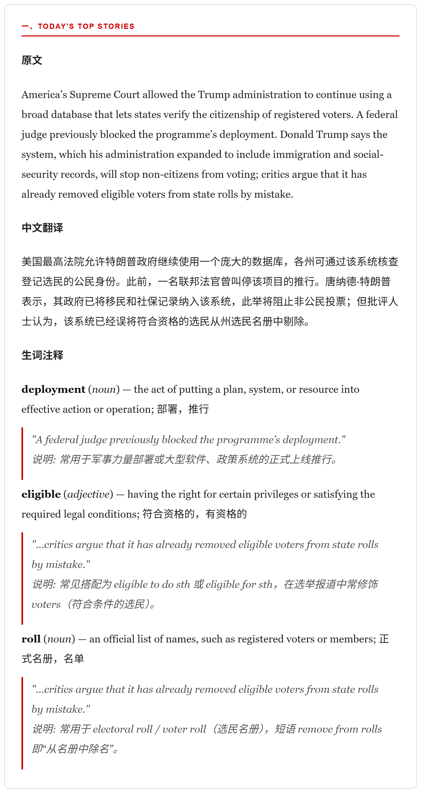

# ecoesp - Economist Espresso Study Pack

A small tool that turns the daily [Economist Espresso](https://www.economist.com/espresso) "The world in brief" email into a bilingual study pack.

It reads the latest newsletter from your Gmail, uses Google's Gemini models to translate it into Chinese and annotate the tricky vocabulary, generates configured spoken recordings, and emails the HTML, plain-text, and MP3s back to you. One story of the email:

<picture>
  <source media="(prefers-color-scheme: dark)" srcset="media/sample-email-dark.png">
  
</picture>

By default, for each *Today's Top Stories* bullet the recording plays: English original → vocabulary explanation → English original → Chinese translation → English original once more — a rhythm for listening practice. You can change the order, add more recordings, or generate a plain read-through — see [Optional: make it yours](#optional-make-it-yours).

[Hear that rhythm for the story above](https://ycheoo.github.io/ecoesp/) (the raw [mp3](media/sample-study.mp3) is in the repo).

## What you need

- Linux x86_64 for the prebuilt binary, or Linux with Python 3.10+ to run from source
- `ffmpeg`
- A Google account whose Gmail receives the Espresso newsletter
- Gmail API OAuth credentials (Desktop app) — free
- One or more [Gemini API keys](https://aistudio.google.com/apikey) — the free tier is enough to try it

## Install

### Prebuilt binary

```bash
sudo apt install ffmpeg curl
curl -fsSLO https://github.com/ycheoo/ecoesp/releases/latest/download/ecoesp_linux_amd64.tar.gz
tar xzf ecoesp_linux_amd64.tar.gz
install -Dm755 ecoesp ~/.local/bin/ecoesp
~/.local/bin/ecoesp --version
```

This fetches the latest release; a specific version is on the [Releases](https://github.com/ycheoo/ecoesp/releases) page under its version-stamped name. The binary bundles Python and the application's dependencies; only `ffmpeg` must be on `PATH`. Make sure `~/.local/bin` is on your `PATH`.

### Run from source

On Debian or Ubuntu:

```bash
sudo apt install python3 python3-venv ffmpeg
git clone https://github.com/ycheoo/ecoesp.git
cd ecoesp
python3 -m venv .venv
.venv/bin/pip install -r requirements.txt
```

The rest of this README writes `ecoesp` for the command; from a source checkout, run `.venv/bin/python -m ecoesp` instead.

## 1. Gmail OAuth

1. In the [Google Cloud Console](https://console.cloud.google.com/), create a project and **enable the Gmail API**.
2. Configure an **External** OAuth consent screen. It can stay in **Testing** while you try things out (add your Gmail address as a test user), but switch it to **In production** before relying on scheduled runs: Google [expires refresh tokens](https://developers.google.com/identity/protocols/oauth2#expiration) after seven days while an app with Gmail scopes is in Testing. The unverified-app warning it may show is fine for a personal project.
3. Create an **OAuth Client ID** of type **Desktop app** and download the JSON.
4. Save it as `~/.config/ecoesp/credentials.json` and lock it down:

```bash
mkdir -p ~/.config/ecoesp
mv ~/Downloads/client_secret_*.json ~/.config/ecoesp/credentials.json
chmod 600 ~/.config/ecoesp/credentials.json
```

Then authorize — this needs none of the later configuration:

```bash
ecoesp auth
```

It requests read-only + send access to Gmail and caches the token at `~/.local/state/ecoesp/token.pickle`. Pipeline runs refresh that token silently but never start authorization themselves, so a scheduled run can never hang waiting for a person. If you authorized while the app was still in Testing, switch it to In production, `rm ~/.local/state/ecoesp/token.pickle`, and authorize again.

On a headless server, `ecoesp auth` prints an authorization link instead of opening a browser. Open it on any device and approve; the browser then lands on a `localhost` page that fails to load — expected. Paste that page's full URL back into the terminal. (A `token.pickle` authorized on another machine also works: copy it to `~/.local/state/ecoesp/token.pickle` and `chmod 600` it.)

## 2. Configuration

Create the configuration file and restrict its permissions:

```bash
mkdir -p ~/.config/ecoesp
touch ~/.config/ecoesp/.env
chmod 600 ~/.config/ecoesp/.env
```

Open `~/.config/ecoesp/.env` in an editor and set at least these values:

```dotenv
# One or more Gemini API keys, comma-separated. More keys = more throughput and
# quota headroom for the audio step; give each key its own Google Cloud project.
GEMINI_API_KEY=your-key-1,your-key-2

# The Gmail account that receives the Espresso email (and sends the result).
READER_EMAIL=you@gmail.com

# Where to send the finished study pack (can be the same address).
DEST_EMAIL=you@gmail.com

# How to find the source email.
GMAIL_QUERY=from:noreply@e.economist.com subject:"world in brief"
```

Everything else is optional and documented in [`.env.example`](.env.example) (model choices, TTS voice, timeouts); in a source checkout you can copy that file instead of starting empty. Standard `http_proxy`, `https_proxy`, and `no_proxy` environment variables are supported.

## 3. Run

```bash
ecoesp
```

It looks for a matching email from the last 24 hours, builds the translation, vocabulary, and audio, and emails the result. Each message is delivered only once; useful flags:

| Flag | Effect |
| --- | --- |
| `--force` | Rebuild and resend the latest matching message even if already delivered |
| `--require-audio` | Fail instead of sending a text-only email when audio generation fails |
| `--prepare-only` | Build the translation and scripts but skip TTS and sending |
| `--lookback-hours N` | Search the last `N` hours instead of 24 |
| `-v`, `--verbose` | Show per-segment TTS progress, including the selected model and API-key position |
| `-V`, `--version` | Print the version (release binaries report their tag; source runs report `dev`) |

If audio generation fails (for example the Gemini TTS free-tier quota runs out), the email is still sent without the MP3s; `--require-audio` fails instead. A missing `ffmpeg` is detected up front: the run still sends the translated email without audio, while `--require-audio` exits before any Gemini call. `--prepare-only` does not need `ffmpeg` at all.

## Optional: make it yours

Everything below is optional — the tool works out of the box without any of it.

**The recordings.** `~/.config/ecoesp/audio.json`, written on first run, controls how many MP3s you get and how each is built. Each track becomes one attachment, `<name>_<date>.mp3`:

```json
{
  "tracks": [
    { "name": "study", "segments": ["original", "vocab", "original", "translation", "original"] },
    { "name": "listen", "segments": ["original"], "opening": false }
  ]
}
```

`name` may contain ASCII letters, digits, hyphens, and underscores. `segments` is the per-bullet order, chosen from `original`, `vocab`, and `translation`. Optional per track: `opening` (default `true`), `segment_gap_seconds` (default `0.8`), `bullet_gap_seconds` (default `1.2`); gaps must be between `0` and `60` seconds. Only the parts some track references are generated at all.

**An opening jingle.** Drop a clip at `~/.config/ecoesp/opening.pcm` to play a personal intro before each track whose `opening` is true. It must be raw signed 16-bit little-endian PCM, 24kHz, mono — the format Gemini TTS returns — so convert yours with:

```bash
ffmpeg -i my-opening.mp3 -f s16le -ar 24000 -ac 1 ~/.config/ecoesp/opening.pcm
```

**The narration and translation prompts.** Drop a file at `~/.config/ecoesp/prompts/<name>.md` to replace any shipped prompt — `tts_original.md`, `tts_vocab.md`, `tts_translation.md`, `text_translation.md`, `text_vocab.md`. Only the ones you supply are overridden; the rest keep shipping defaults, so they still improve when you upgrade.

> Keep the markdown headings the shipped `text_translation.md` produces (`## 一`, `#### 原文`, `#### 中文翻译`, `#### 生词注释`). The audio pipeline parses them to split each story, so a prompt that stops emitting them will break audio generation.

**The email template.** Drop a file at `~/.config/ecoesp/email.html`; `{body}` is replaced with the rendered story.

**The subject line.** `SUBJECT_PREFIX` in your `.env` — see `.env.example`.

## Optional: run it daily with systemd

Switch the OAuth consent screen to **In production** as described above and run `ecoesp auth` once in a terminal first — the timer cannot answer an authorization prompt. Then create `~/.config/systemd/user/ecoesp.service`:

```ini
[Unit]
Description=Translate the latest Economist Espresso email

[Service]
Type=oneshot
ExecStart=%h/.local/bin/ecoesp
TimeoutStartSec=30min
```

`TimeoutStartSec` bounds the complete run; systemd otherwise gives a `Type=oneshot` service no start timeout. The service does not read shell startup files such as `.zshrc`, so if ecoesp needs a proxy, add `Environment="https_proxy=..."` lines under `[Service]`. When running from source, add `WorkingDirectory=/absolute/path/to/ecoesp` and use `ExecStart=/absolute/path/to/ecoesp/.venv/bin/python -m ecoesp`.

And `~/.config/systemd/user/ecoesp.timer`:

```ini
[Unit]
Description=Run the Espresso translator daily

[Timer]
OnCalendar=*-*-* 09:00:00
Persistent=true

[Install]
WantedBy=timers.target
```

Then enable it:

```bash
# On a headless server, keep the user service manager running after logout.
sudo loginctl enable-linger "$USER"
systemctl --user daemon-reload
systemctl --user enable --now ecoesp.timer
systemctl --user list-timers ecoesp.timer
journalctl --user -u ecoesp.service -n 100   # inspect logs
```

## Optional: build a single-file binary

To compile everything (Python included, ffmpeg excluded) into one Linux executable:

```bash
packaging/build.sh
```

The result is `dist/ecoesp`; it reads the same configuration from the same places, so `ExecStart` in the systemd unit can point at it instead of the venv. The script builds inside its own temporary venv, so it won't touch your environment. A binary runs only on systems whose glibc is at least as new as the build machine's.

## Where things live

The tool follows the XDG base-directory convention and never writes into the project folder:

| Path | Contents |
| --- | --- |
| `~/.cache/ecoesp/` | Generated text and audio, grouped by Gmail message ID (auto-pruned after 7 days) |
| `~/.config/ecoesp/` | `.env`, `credentials.json`, `audio.json`, `opening.pcm`, and any prompt or email-template overrides |
| `~/.local/state/ecoesp/` | OAuth token, list of already-delivered messages |

## Troubleshooting

- **`credentials.json not found`** — make sure the OAuth JSON is at `~/.config/ecoesp/credentials.json` (or set `GOOGLE_CREDENTIALS_PATH`).
- **No email arrives** — check the terminal/journal output; confirm `GMAIL_QUERY` matches a message from the last 24 hours (`--lookback-hours` widens the window).
- **Email has no MP3** — install `ffmpeg` if the output says it is missing. Other audio failures are reported as `Audio generation failed`; TTS quota exhaustion is the most common, and adding more `GEMINI_API_KEY` values gives the audio step more quota.

## License

[MIT](LICENSE).
